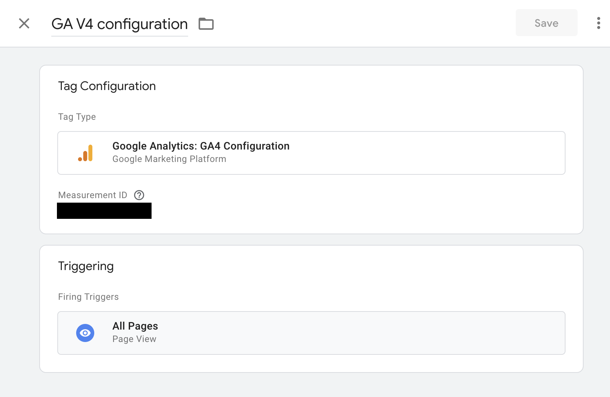
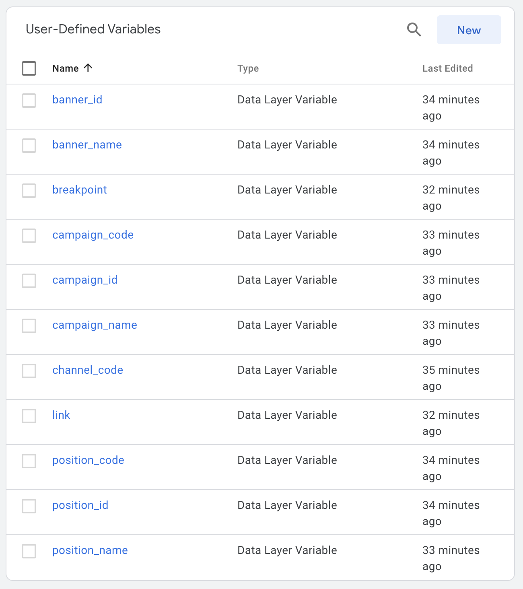
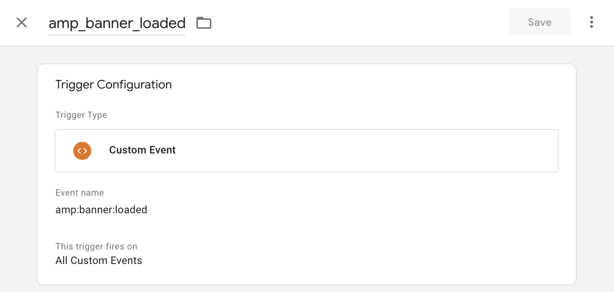
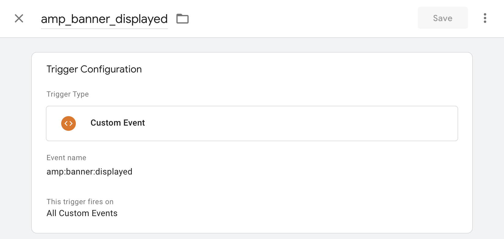
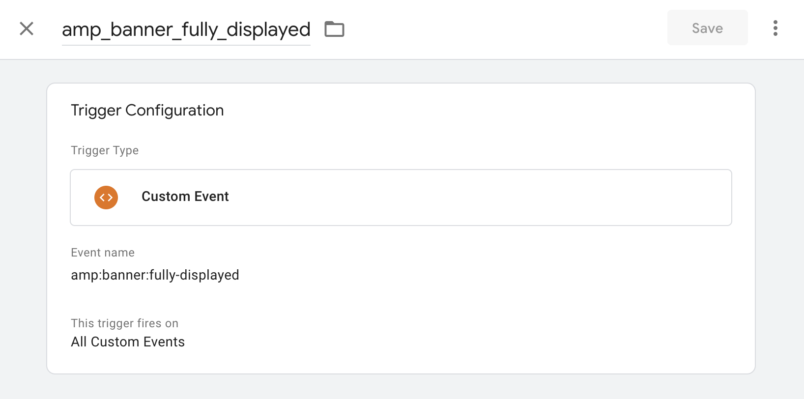
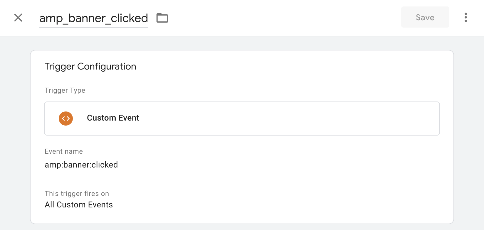
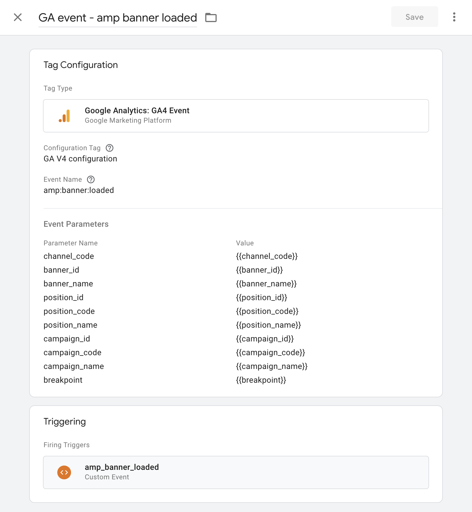
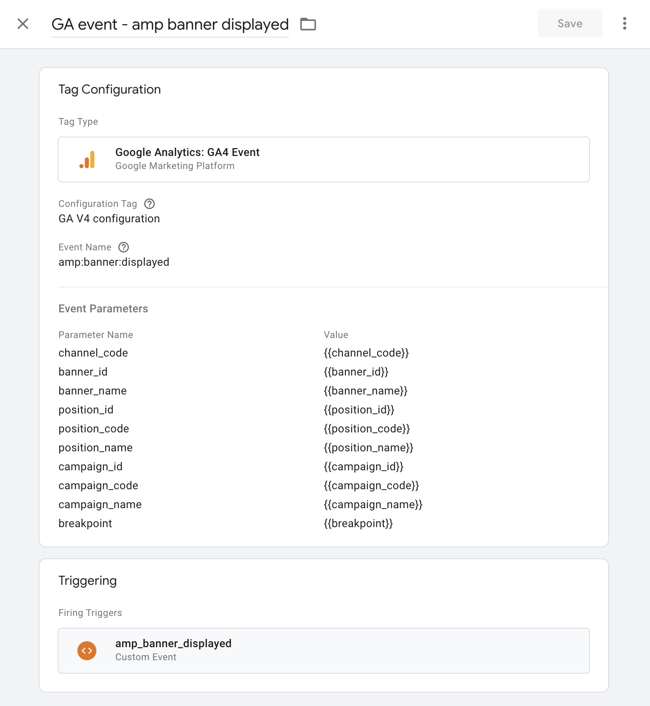
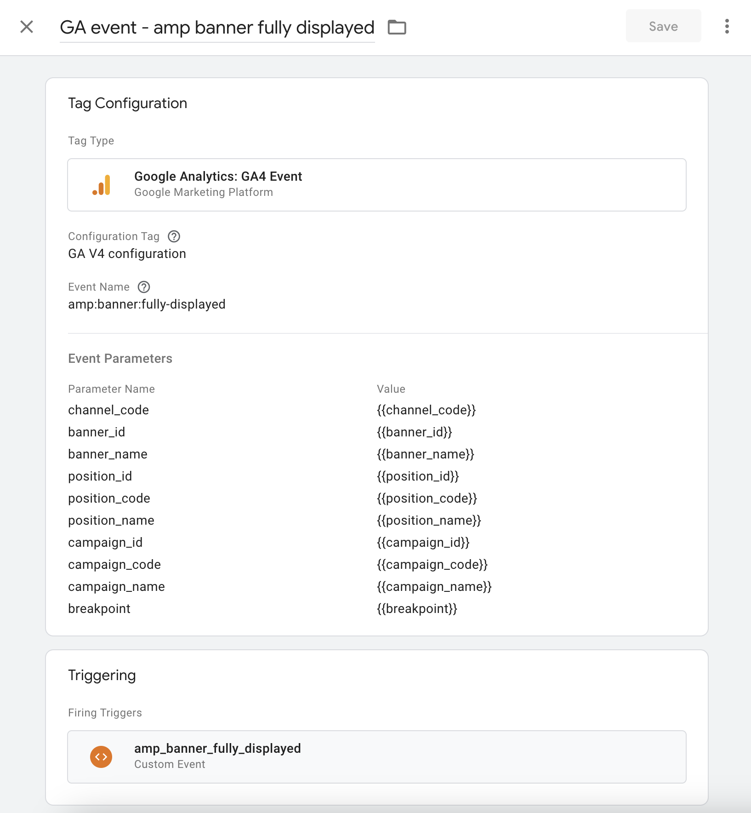
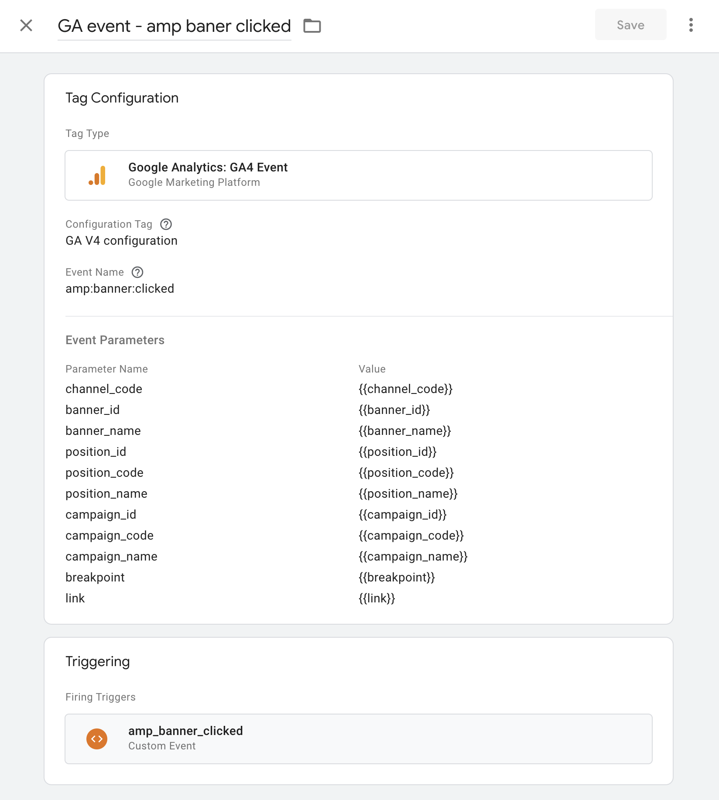

<h1>AMP Client JS</h1>
<h2 align="center">GTM Metrics Guide</h2>

To send events to GA via GTM, you need to configure variables, triggers and tags.
We should start by setting the tag "Google Analytics: GA4 Configuration".

Now go to the "Variables" tab and declare all the variables that are passed to the metric events. All variables are of type "DataLayer variable".

Then you have to set the triggers. Let's go to the "Triggers" tab and define the following four triggers:

Now we can finally set the tags for all four events.

That's all, sending events through GTM should work now.
